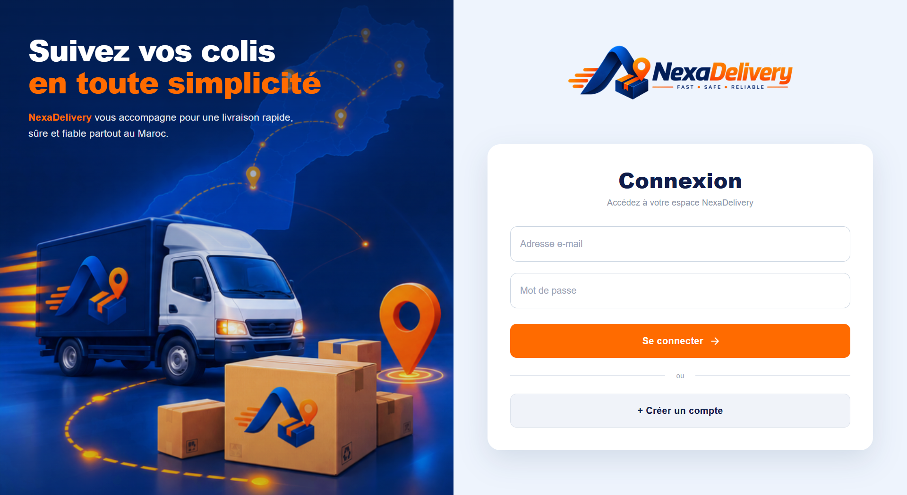

# NexaDelivery --- Frontend

------------------------------------------------------------------------

# 1. Nom du projet

**Nom du projet :** NexaDelivery --- Interface Web de gestion et de
suivi des livraisons

### Dépôt du projet

-   **Frontend (React)** :
    https://github.com/zakariaoutla/NexaDelivery_frontend.git

------------------------------------------------------------------------

# 2. Présentation du projet

NexaDelivery Frontend est l'interface web de la plateforme
**NexaDelivery**, développée avec **React 19 et Vite**.

L'application propose une page d'accueil publique, une authentification,
un suivi public des livraisons ainsi que trois espaces protégés adaptés
aux rôles **ADMIN**, **MERCHANT** et **DRIVER**.

Le frontend communique avec l'API backend via **Axios**, protège les
routes selon le rôle de l'utilisateur, reçoit des notifications en temps
réel avec **STOMP/WebSocket** et intègre des fonctionnalités de
cartographie et de visualisation de données.

------------------------------------------------------------------------

# 3. Problématique

Une plateforme de livraison doit proposer une interface claire
permettant à chaque utilisateur d'accéder uniquement aux fonctionnalités
qui correspondent à son rôle.

NexaDelivery Frontend répond à ce besoin en séparant les espaces
administrateur, commerçant et livreur, tout en centralisant la
navigation, les appels API, la gestion de l'authentification, les
notifications, le suivi des livraisons et les tableaux de bord.

------------------------------------------------------------------------

# 4. Fonctionnalités principales

-   **Afficher une landing page publique** présentant la plateforme.
-   **Authentifier les utilisateurs** avec les pages de connexion et
    d'inscription.
-   **Protéger les routes** selon les rôles `ADMIN`, `MERCHANT` et
    `DRIVER`.
-   **Rediriger automatiquement** un utilisateur authentifié vers son
    dashboard.
-   **Permettre au commerçant** de créer et consulter ses livraisons,
    suivre une livraison, gérer son profil et ses points de collecte.
-   **Permettre au livreur** de consulter son dashboard, ses livraisons
    et son profil.
-   **Permettre à l'administrateur** de gérer les livraisons, livreurs,
    commerçants et véhicules.
-   **Afficher des statistiques** avec des composants de dashboard et
    Recharts.
-   **Recevoir des notifications en temps réel** via STOMP/WebSocket.
-   **Afficher et exploiter la localisation** avec Google Maps et
    Leaflet.
-   **Permettre le suivi public** d'une livraison depuis la page
    `/tracking`.
-   **Afficher des notifications visuelles** avec React Toastify.

------------------------------------------------------------------------

# 5. Technologies utilisées

  -----------------------------------------------------------------------
Technologie            Utilisation dans le projet
  ---------------------- ------------------------------------------------
React 19               Construction de l'interface utilisateur

Vite 8                 Environnement de développement et build

React Router DOM 7     Navigation et gestion des routes

Material UI 9          Composants d'interface et icônes

Emotion                Styling utilisé avec Material UI

Axios                  Communication avec l'API backend

jwt-decode             Décodage des informations du JWT côté client

STOMP.js               Communication temps réel avec WebSocket

Google Maps React      Intégration de Google Maps

Leaflet / React        Affichage de cartes et données géographiques
Leaflet

Recharts               Graphiques et statistiques des dashboards

React Toastify         Notifications visuelles

OXLint                 Analyse statique du code

Docker                 Build et conteneurisation du frontend

Nginx                  Serveur web de production et proxy `/api/`

Git & GitHub           Versionnement du code
-----------------------------------------------------------------------

------------------------------------------------------------------------

# 6. Architecture du frontend

Le code est organisé par responsabilités :

``` text
src/
├── api/
├── components/
│   ├── CollectionPoint/
│   ├── Dashboard/
│   └── Home/
├── Config/
├── hooks/
├── layout/
├── page/
│   ├── admin/
│   ├── driver/
│   └── merchant/
├── App.jsx
├── App.css
├── index.css
└── main.jsx
```

### Rôle des principaux dossiers

-   `api/` : services Axios et WebSocket utilisés pour communiquer avec
    le backend.
-   `components/` : composants réutilisables de la landing page, des
    dashboards et de la cartographie.
-   `Config/` : contexte d'authentification et protection des routes.
-   `hooks/` : hooks personnalisés, notamment pour la localisation du
    livreur.
-   `layout/` : layout commun des dashboards.
-   `page/` : pages publiques et pages organisées par rôle.

------------------------------------------------------------------------

# 7. Gestion des rôles et des routes

Le composant `RouteGuard` protège les pages selon l'état
d'authentification et le rôle.

Les dashboards sont associés aux rôles suivants :

``` text
ADMIN    → /admin
MERCHANT → /merchant
DRIVER   → /driver
```

Un utilisateur non authentifié qui tente d'accéder à une route protégée
est redirigé vers `/login`.

Un utilisateur déjà authentifié qui tente d'accéder à `/login` ou
`/register` est automatiquement redirigé vers son dashboard.

------------------------------------------------------------------------

# 8. Routes principales

## Routes publiques

``` text
/
 /login
 /register
 /tracking
```

## Administration

``` text
/admin
/admin/deliveries
/admin/deliveries/:id
/admin/drivers
/admin/drivers/:id
/admin/vehicles
/admin/merchants
/admin/merchants/:id
```

## Commerçant

``` text
/merchant
/merchant/deliveries
/merchant/deliveries/create
/merchant/deliveries/:id
/merchant/deliveries/:id/tracking
/merchant/profile
/merchant/collection-points
```

## Livreur

``` text
/driver
/driver/deliveries
/driver/profile
```

------------------------------------------------------------------------

# 9. Communication avec le backend

L'application utilise une instance Axios centralisée.

La base URL est récupérée depuis :

``` env
VITE_API_URL=
```

Si cette variable n'est pas définie, l'application utilise :

``` text
/api
```

Un intercepteur ajoute automatiquement le JWT aux requêtes lorsqu'un
token existe dans `localStorage` :

``` http
Authorization: Bearer <JWT_TOKEN>
```

Le frontend contient des services dédiés pour :

``` text
auth
collectionPoint
delivery
driverLocation
driver
merchant
notification
rating
statistics
tracking
vehicle
webSocket
```

------------------------------------------------------------------------

# 10. Notifications WebSocket

Le projet utilise **STOMP.js** pour se connecter au WebSocket du
backend.

La connexion utilise :

``` env
VITE_WEBSOCKET_URL=
```

Le JWT est transmis dans les headers de connexion STOMP.

Le client s'abonne à :

``` text
/user/queue/notifications
```

Le service prévoit également :

-   une reconnexion automatique après 5 secondes ;
-   des heartbeats entrants et sortants ;
-   la gestion des erreurs STOMP et WebSocket.

------------------------------------------------------------------------

# 11. Cartographie et localisation

Le frontend contient plusieurs composants liés à la localisation :

``` text
AddressAutocomplete.jsx
CollectionPointMap.jsx
AdminDriverMap.jsx
DriverLocationTracker.jsx
DeliveryTracking.jsx
```

Le projet utilise notamment :

-   `@vis.gl/react-google-maps`
-   `leaflet`
-   `react-leaflet`

La clé Google Maps est fournie avec :

``` env
VITE_GOOGLE_MAPS_API_KEY=
```

> Ne publiez jamais une clé API non restreinte dans le dépôt.

------------------------------------------------------------------------

# 12. Installation et lancement

## 12.1 Prérequis

Pour lancer le frontend localement :

-   Node.js
-   npm
-   Git
-   Backend NexaDelivery en fonctionnement
-   Docker si vous souhaitez lancer la version conteneurisée

------------------------------------------------------------------------

## 12.2 Cloner le dépôt

``` bash
git clone https://github.com/zakariaoutla/NexaDelivery_frontend.git
cd NexaDelivery_frontend
```

------------------------------------------------------------------------

## 12.3 Installer les dépendances

``` bash
npm install
```

Le Dockerfile du projet utilise `npm ci` lors du build.

------------------------------------------------------------------------

## 12.4 Variables d'environnement

Créer ou compléter le fichier `.env` :

``` env
VITE_API_URL=http://localhost:8080/api
VITE_GOOGLE_MAPS_API_KEY=YOUR_GOOGLE_MAPS_API_KEY
VITE_WEBSOCKET_URL=ws://localhost:8080/ws
```

Adaptez les URLs à votre environnement backend.

------------------------------------------------------------------------

## 12.5 Lancer en développement

``` bash
npm run dev
```

Vite affiche ensuite dans le terminal l'adresse locale utilisée par
l'application.

------------------------------------------------------------------------

## 12.6 Build de production

``` bash
npm run build
```

Les fichiers générés sont placés dans :

``` text
dist/
```

------------------------------------------------------------------------

## 12.7 Prévisualiser le build

``` bash
npm run preview
```

------------------------------------------------------------------------

## 12.8 Vérifier le code

``` bash
npm run lint
```

------------------------------------------------------------------------

# 13. Docker et Nginx

Le projet utilise un **Dockerfile multi-stage**.

### Étape 1 --- Build

``` text
Node 22 Alpine
      │
      ▼
npm ci
      │
      ▼
npm run build
```

### Étape 2 --- Production

``` text
dist/
  │
  ▼
Nginx Alpine
  │
  ▼
Port 80
```

Pour construire l'image :

``` bash
docker build -t nexadelivery-frontend .
```

Le fichier `nginx.conf` :

-   sert l'application React depuis `/usr/share/nginx/html` ;
-   utilise `try_files` pour supporter React Router ;
-   transmet les requêtes `/api/` vers le service backend `app:8080`.

------------------------------------------------------------------------

# 14. Captures d'écran

Pour présenter le frontend sur GitHub, ajoutez vos captures dans un
dossier `screenshots/`.

## Page d'accueil


Cette capture doit montrer la landing page publique de NexaDelivery.

------------------------------------------------------------------------

## Connexion



Cette capture doit montrer la page de connexion.

------------------------------------------------------------------------

## Dashboard commerçant


Cette capture peut montrer les statistiques et les informations
principales de l'espace commerçant.

------------------------------------------------------------------------

## Création d'une livraison


Cette capture doit montrer le formulaire React utilisé par le commerçant
pour créer une livraison.

------------------------------------------------------------------------

## Dashboard livreur


Cette capture doit montrer l'espace principal du livreur.

------------------------------------------------------------------------

## Dashboard administrateur


Cette capture doit montrer l'espace de supervision de l'administrateur.

------------------------------------------------------------------------

# 15. Contribution personnelle

Ma contribution a porté sur la conception et le développement de
l'interface frontend de NexaDelivery avec **React et Vite**.

J'ai développé la landing page, les pages de connexion et d'inscription,
les dashboards adaptés aux rôles `ADMIN`, `MERCHANT` et `DRIVER`, ainsi
que les différentes pages de gestion des livraisons, utilisateurs,
véhicules, profils et points de collecte.

J'ai également travaillé sur l'intégration de l'API backend avec Axios,
la protection des routes avec `RouteGuard`, la gestion du JWT côté
client, les notifications temps réel avec STOMP/WebSocket et les
fonctionnalités de cartographie et de localisation.

Enfin, j'ai préparé la version de production avec Docker et Nginx.

------------------------------------------------------------------------

# 16. Difficultés rencontrées

## Difficulté 1 --- Protection et redirection des routes

### Problème rencontré

L'application possède plusieurs espaces selon le rôle de l'utilisateur.
Il fallait empêcher un utilisateur non authentifié d'accéder aux
dashboards et éviter qu'un utilisateur déjà connecté retourne sur les
pages `/login` ou `/register`.

### Recherches / Tests

J'ai centralisé cette logique dans un composant `RouteGuard` qui utilise
le contexte d'authentification, les rôles autorisés et une option
`guestOnly`.

### Solution

Le guard redirige les utilisateurs non connectés vers `/login`, contrôle
`allowedRoles` et redirige les utilisateurs déjà connectés vers
`/admin`, `/merchant` ou `/driver` selon leur rôle.

### Ce que j'ai appris

Cette partie m'a permis de mieux comprendre les routes protégées, les
routes imbriquées et les redirections avec React Router.

------------------------------------------------------------------------

## Difficulté 2 --- Gestion centralisée des appels API

### Problème rencontré

Les appels vers le backend nécessitent l'envoi du token JWT et une
gestion cohérente des erreurs HTTP.

### Recherches / Tests

J'ai créé une instance Axios commune avec un intercepteur de requête qui
récupère le token depuis `localStorage`.

### Solution

Le token est automatiquement ajouté dans le header `Authorization`. Un
intercepteur de réponse traite également plusieurs statuts HTTP comme
`400`, `401`, `403`, `404` et `500`.

### Ce que j'ai appris

Cette difficulté m'a permis de mieux comprendre les interceptors Axios
et la centralisation de la communication entre le frontend et l'API.

------------------------------------------------------------------------

## Difficulté 3 --- Notifications en temps réel

### Problème rencontré

Le frontend devait recevoir les nouvelles notifications sans effectuer
constamment des requêtes HTTP.

### Recherches / Tests

J'ai intégré `@stomp/stompjs` et créé un service WebSocket centralisé
utilisant le JWT pour établir la connexion.

### Solution

Le frontend se connecte au WebSocket du backend et s'abonne à
`/user/queue/notifications`. Une stratégie de reconnexion automatique
est également configurée.

### Ce que j'ai appris

Cette fonctionnalité m'a permis de mieux comprendre la communication
temps réel, STOMP et la différence entre les appels REST et WebSocket.

------------------------------------------------------------------------

## Difficulté 4 --- Déploiement d'une SPA avec Nginx

### Problème rencontré

Une application React utilisant React Router doit continuer à
fonctionner lorsqu'une URL interne est ouverte ou actualisée
directement.

### Recherches / Tests

J'ai configuré Nginx pour servir les fichiers du build Vite et rediriger
les routes inconnues vers `index.html`.

### Solution

La configuration utilise :

``` nginx
try_files $uri $uri/ /index.html;
```

Elle contient également un proxy `/api/` vers le backend.

### Ce que j'ai appris

Cette partie m'a permis de mieux comprendre le déploiement d'une SPA
React avec Nginx et la communication entre services Docker.

------------------------------------------------------------------------

# 17. Améliorations possibles

Dans une prochaine version, il serait possible de :

-   renforcer les tests automatisés du frontend ;
-   centraliser davantage la gestion des erreurs et des redirections ;
-   améliorer l'accessibilité des différentes interfaces ;
-   compléter la configuration de production des variables
    d'environnement et des services externes.

### Conclusion

Ces améliorations permettraient de rendre l'interface encore plus
robuste, maintenable et adaptée à un déploiement en production.

------------------------------------------------------------------------

# 18. Point de vigilance identifié dans le code actuel

Dans `axiosInstance.js`, les erreurs `403` et `404` redirigent
actuellement vers :

``` text
/access-denied
/404
```

alors que `App.jsx` déclare :

``` text
/unauthorized
*
```

Il est conseillé d'harmoniser ces redirections afin d'utiliser les
routes réellement déclarées dans l'application.

------------------------------------------------------------------------

# 19. Checklist finale

## Présentation

-   [x] Le projet frontend est présenté.
-   [x] Les trois rôles sont identifiés.
-   [x] Les principales fonctionnalités sont expliquées.

## Technologies

-   [x] Les technologies correspondent au `package.json`.
-   [x] Leur utilisation est précisée.

## Architecture

-   [x] La structure principale de `src/` est documentée.
-   [x] Les routes publiques et protégées sont présentées.
-   [x] La communication avec l'API est expliquée.

## Installation

-   [x] Les prérequis sont présents.
-   [x] Les commandes npm sont indiquées.
-   [x] Les variables d'environnement nécessaires sont documentées.
-   [x] Docker et Nginx sont présentés.

## Captures

-   [ ] Ajouter les captures réelles dans `screenshots/`.
-   [ ] Vérifier les chemins des images avant le push GitHub.

## Contribution

-   [x] La contribution frontend est décrite.
-   [x] Les principales parties développées sont identifiées.

## Difficultés

-   [x] Les difficultés sont expliquées.
-   [x] Les solutions mises en place sont décrites.
-   [x] Les apprentissages sont présentés.

------------------------------------------------------------------------

# Auteur

**Zakaria OUTLA**

Projet réalisé dans le cadre de la formation en développement Full
Stack.
